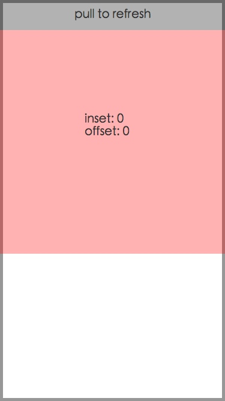

# "Pull To Refresh" Jitter

This demo manipulates a UIScrollView's contentInset to implement the "Pull to Refresh" UI. It showcases the jitter that occurs when contentInset is set, and scrolling is ongoing.

This seems to be a bug with the native UIScrollView (see [iOS Demo](https://github.com/hayeah/rn-ScrollViewContentInsetChangeJitter/tree/master/ScrollViewChangeInsetJitter-ios-Demo)).

# Video Demo

[](https://youtu.be/s7AtL673v4U)

# Problem Explanation

Start with negative contentInset to hide refresh header.


Scroll until there is enough space to contain the "pull to refresh" header, then set contentInset to 0.


Setting contentInset to 0 causes offset to "jump".


On touch release, it scrolls back to 0 as expected.



# Analysis

By using the debugger to see what is setting the scroll view's `contentOffset` (setting breakpoint [here](https://github.com/hayeah/rn-ScrollViewContentInsetChangeJitter/blob/70c47e9cbeadf155a73d02acd81fb07b2bb12304/ScrollViewChangeInsetJitter-ios-Demo/ScrollViewChangeInsetJitter/ViewController.swift#L33)), it seems that this problem is caused by scroll view's gesture handling.

```
#0  0x0000000100dd8466 in ScrollViewChangeInsetJitter.ViewController.TracingScrollView.contentOffset.didset : C.CGPoint at /Users/howard/ios/react-native/ScrollViewChangeInsetJitter/ScrollViewChangeInsetJitter/ViewController.swift:33
#1  0x0000000100dd8329 in ScrollViewChangeInsetJitter.ViewController.TracingScrollView.contentOffset.setter : C.CGPoint ()
#2  0x0000000100dd8236 in @objc ScrollViewChangeInsetJitter.ViewController.TracingScrollView.contentOffset.setter : C.CGPoint ()
#3  0x000000010189a102 in -[UIScrollView _updatePanGesture] ()
```